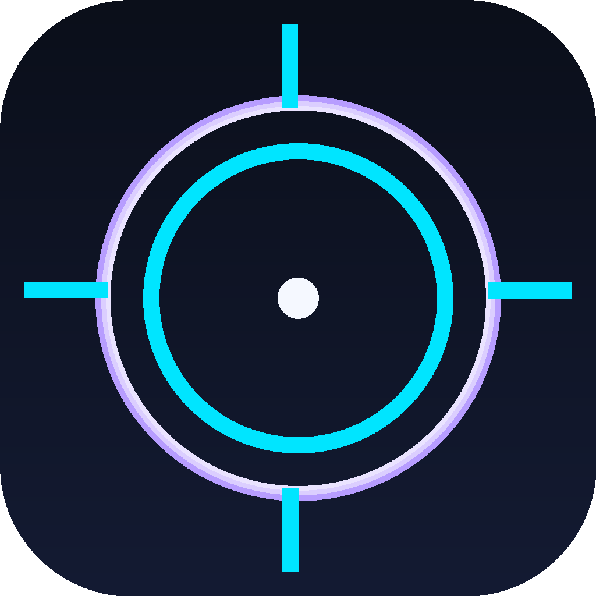

<div align="center">



# AIMORA

**Precision. Overlay. Victory.**

A production-ready, offline-first Android crosshair overlay app, built with Flutter & Material 3.

[](https://github.com/Mahmadsoni/aimora/actions/workflows/build.yml)
[](https://github.com/Mahmadsoni/aimora/actions/workflows/release.yml)


</div>

---

## What is AIMORA?

AIMORA draws a fully customizable crosshair **on top of any app or game**
on your Android device — perfect for games that hide their own reticle,
sniper scopes without a dot, or any first/third-person shooter where a
sharper aim point helps. Everything runs **100% on-device**: no account,
no internet connection, no ads, no tracking.

## ✨ Features

| Category | Details |
|---|---|
| **Overlay** | System-level draw-over-other-apps overlay, click-through, live-updating |
| **10 Crosshair Types** | Dot · Cross · Circle · Tactical · Dynamic · Sniper · Pro · Minimal · Neon · Cyber |
| **Full Customization** | Color (wheel + swatches), size, thickness, gap, opacity, outline toggle |
| **Crosshair Pack System** | Every type is a self-contained "pack" rendered by one shared painter |
| **Favorites** | Star any crosshair type for instant access |
| **Presets** | Save/name/delete full configurations, recall in one tap |
| **Profiles** | Independent configs per game (e.g. "PUBG", "Free Fire"), switch instantly |
| **Theming** | Material 3, Dark Mode & Light Mode, system-aware |
| **Localization** | English 🇬🇧 · Русский 🇷🇺 · Тоҷикӣ 🇹🇯 |
| **Offline-first** | All data (profiles, presets, favorites, settings) stored locally via `SharedPreferences` |
| **Fast & Fluid** | Custom-painted vector rendering (no rasterized assets), 60fps overlay |

## 🖼️ Screens

- **Splash** — animated brand mark reveal
- **Onboarding** — 4-step guided intro with live crosshair previews
- **Overlay Control (Home)** — live preview, start/stop, color/size/thickness/gap/opacity controls, save-as-preset
- **Gallery** — browse all 10 types, favorites tab, presets tab
- **Profile** — manage per-game profiles
- **Settings** — theme, language, overlay permission status, about

## 🎨 Brand

- **Name:** AIMORA (*Aim* + aura of precision)
- **Palette:** Electric Cyan `#00E5FF` · Deep Violet `#7C4DFF` · Deep Space Navy `#0B0F1A → #141B33`
- **Typography:** [Sora](https://fonts.google.com/specimen/Sora) (display/headlines) + [Inter](https://fonts.google.com/specimen/Inter) (body/labels), loaded via `google_fonts` — no bundled font files
- **Logo:** a cyan crosshair ring with a violet glow, generated in `tools_gen_logo.py` (master PNG + all `mipmap-*` launcher densities + Play Store 512px icon + `assets/icons/logo.svg`)

## 🏗️ Architecture

Clean Architecture (`domain` → `data` → `presentation`), SOLID principles,
repository-pattern-ready data layer, Riverpod for state management. Full
write-up in [`docs/ARCHITECTURE.md`](docs/ARCHITECTURE.md).

```
lib/
├── core/            # theme, constants, services (storage / overlay / permission)
├── domain/          # CrosshairType — pure Dart business entity
├── data/            # CrosshairConfig, PresetModel, ProfileModel (JSON models)
├── presentation/    # providers (Riverpod), screens, widgets
└── overlay/         # overlayMain() — the second-engine system overlay renderer
```

## 🧰 Tech Stack

- **Flutter** 3.27+ / Dart 3.3+
- **State management:** `flutter_riverpod`
- **Overlay:** `flutter_overlay_window`
- **Permissions:** `permission_handler`
- **Storage:** `shared_preferences` (offline-first, no code-gen)
- **Localization:** `easy_localization`
- **Typography:** `google_fonts`
- **Color picker:** `flex_color_picker`

Full dependency list in [`pubspec.yaml`](pubspec.yaml).

## 🚀 Getting started

### Prerequisites

- Flutter SDK 3.27+ (`flutter --version`)
- Android SDK / Android Studio command-line tools
- A physical Android device or emulator running **API 24+**

### Run locally

```bash
git clone https://github.com/Mahmadsoni/aimora.git
cd aimora
flutter pub get
flutter run
```

### Build a release APK

```bash
flutter build apk --release
# output: build/app/outputs/flutter-apk/app-release.apk
```

### Regenerate the logo / launcher icons

```bash
python3 tools_gen_logo.py
```

## 🔐 Signing a release build (optional)

By default, CI builds an **unsigned-equivalent** release APK (falls back
to debug signing so the pipeline never breaks). To produce a properly
signed release:

1. Generate a keystore:
   ```bash
   keytool -genkey -v -keystore release-key.jks -keyalg RSA -keysize 2048 -validity 10000 -alias aimora
   ```
2. Create `android/key.properties`:
   ```properties
   storePassword=YOUR_STORE_PASSWORD
   keyPassword=YOUR_KEY_PASSWORD
   keyAlias=aimora
   storeFile=../release-key.jks
   ```
3. For CI signing, add these repository secrets (Settings → Secrets and
   variables → Actions): `KEYSTORE_BASE64` (base64 of the `.jks` file),
   `KEYSTORE_PASSWORD`, `KEY_ALIAS`, `KEY_PASSWORD`. `release.yml`
   already wires them in automatically when present.

## 🤖 CI/CD (GitHub Actions)

| Workflow | Trigger | Does |
|---|---|---|
| `build.yml` | every push/PR to `main` | `flutter analyze`, `flutter test`, builds a debug APK artifact |
| `release.yml` | pushing a tag `v*.*.*` (or manual dispatch) | Runs tests, builds a **release** split-per-ABI APK, publishes a GitHub Release with the APKs attached |

Cut a release:

```bash
git tag v1.0.0
git push origin v1.0.0
```

## 📲 Installing from Termux → GitHub (step by step)

If you're setting this project up on your phone with **Termux**, here is
the exact path from a fresh clone to a live GitHub repository with CI
running.

1. **Install Termux packages**
   ```bash
   pkg update && pkg upgrade -y
   pkg install git openssh -y
   ```

2. **Configure Git identity** (once)
   ```bash
   git config --global user.name "Mahmadsoni"
   git config --global user.email "your-email@example.com"
   ```

3. **Create a GitHub Personal Access Token**
   Go to GitHub → Settings → Developer settings → Personal access tokens
   → *Fine-grained tokens* → Generate new token, grant it `repo` access,
   copy the token somewhere safe (you'll paste it once as a password).

4. **Create the empty repository on GitHub**
   Go to `https://github.com/new`, owner **Mahmadsoni**, repository name
   `aimora`, keep it empty (no README/license — this project already has
   them), click **Create repository**.

5. **Unzip the project inside Termux**
   ```bash
   cd ~/storage/downloads     # wherever the aimora.zip landed
   pkg install unzip -y
   unzip aimora.zip -d ~/aimora
   cd ~/aimora
   ```
   *(Run `termux-setup-storage` first if `~/storage` doesn't exist yet.)*

6. **Initialize git and make the first commit**
   ```bash
   git init
   git add .
   git commit -m "Initial commit: AIMORA v1.0.0"
   git branch -M main
   ```

7. **Connect to GitHub and push**
   ```bash
   git remote add origin https://github.com/Mahmadsoni/aimora.git
   git push -u origin main
   ```
   When prompted for a password, paste the **Personal Access Token**
   from step 3 (Termux won't show typed characters — that's normal).

8. **Verify CI is running**
   Open `https://github.com/Mahmadsoni/aimora/actions` — the `CI Build`
   workflow should start automatically on the push and build a debug APK
   artifact within a few minutes.

9. **Cut your first release** (optional, once you're ready to publish an APK)
   ```bash
   git tag v1.0.0
   git push origin v1.0.0
   ```
   The `Release` workflow will build release APKs and attach them to a
   new GitHub Release automatically.

> **Note:** Termux itself cannot compile the Android APK (no Android SDK/NDK
> on-device) — that's exactly what the GitHub Actions workflows above are
> for. Termux's job here is only `git` — clone/init/commit/push — while
> GitHub's cloud runners do the actual Flutter/Gradle build.

## 📄 License

MIT © 2026 [Mahmadsoni](https://github.com/Mahmadsoni) — see [LICENSE](LICENSE).
